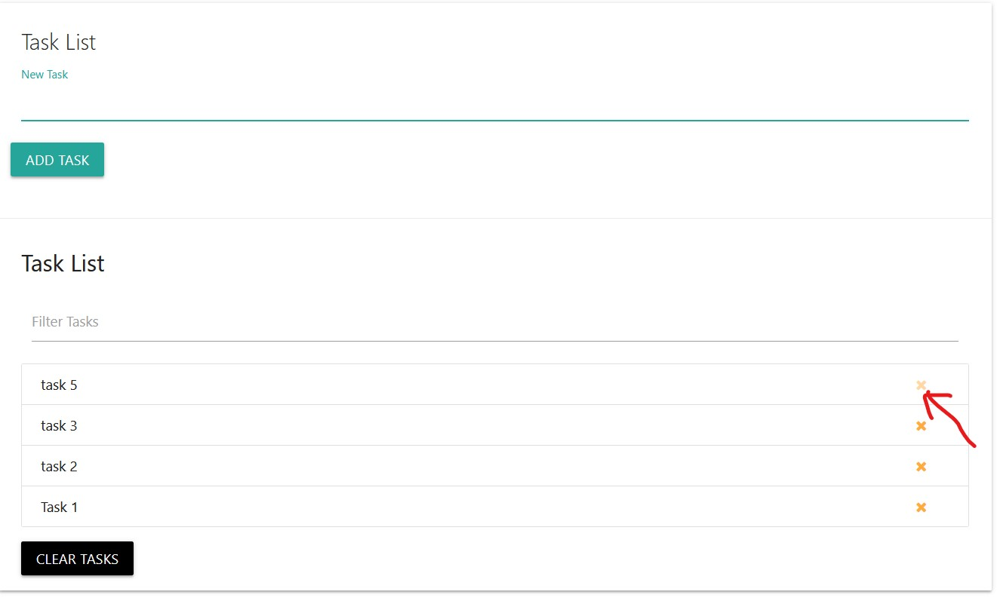

#							Task Manager
A niche looking zen mode task manager that enables you to be completely focused on your **MIT**s or **Most Important Tasks** ,so that you can get more productive and take the most out of the day.

---

## You Can Add Tasks

---
## You can clear the task when done  by clicking the remove icon

---
## You can filter through your tasks super fast as you type along (no reload needed)
[!](http://www.youtube.com/watch?v=YOUTUBE_VIDEO_ID_HERE) 

---
## You clear all tasks at once by clicking `Clear Tasks` Button

---
## All Tasks are saved on the *local storage* , so no need to **register** or `sign up` or any sort of formality, just go the link and start being productive

[Task Manager](https://mahabubarafat.github.io/taskmanager/)

<mark> Please be aware that if you clear your browser data you will loose your previous task list as they are stored locally </mark>

> If you liked my work you can sure give your brother a thumbs up by starring the repo, this means a lot to me. Thank you.
